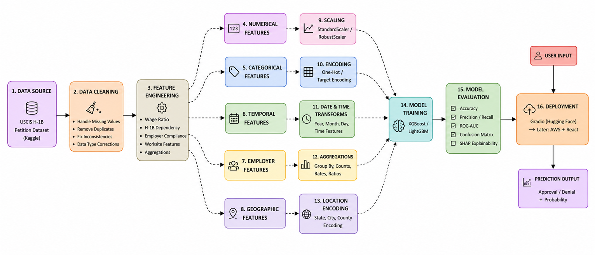

# H1B Visa Approval Prediction for Employer Decision Support (project ongoing) 
<p align="left">
  <!-- Core -->
  
  
  

  <!-- License & Issues -->
  
  

  <!-- Repo Stats -->
  
  

  <!-- Models -->
  

  <!-- Dataset -->
  
  
  <!-- Explainability -->
  

  <!-- Visualization -->
  

  <!-- Deployment -->
  

  <!-- API / Backend -->
  

  <!-- Frontend -->
  

  <!-- Containerization -->
  

  <!-- Runtime -->
   
  
  <!-- DevOps -->
  
  
  
  <!-- Social -->
  

  <!-- Status -->
  
</p> 

 

## Overview 
This project presents an end-to-end machine learning system for H-1B visa approval prediction designed to support employer decision-making using approximately 3.5 million visa application records from 2020–2024. Multiple machine learning models including XGBoost, LightGBM, Random Forest, and ElasticNet are trained and evaluated using performance metrics and SHAP-based explainability to identify the most influential approval drivers. The final selected model is deployed through a Gradio interface on Hugging Face for real-time inference, with future plans for scalable cloud deployment using FastAPI, Docker, AWS, and a React frontend for production-grade serving and interactive user experience. 

## Use Cases 
The H-1B visa process is highly selective, time-consuming, and financially expensive for sponsoring employers, involving legal fees, compliance documentation, prevailing wage requirements, attorney support, and operational delays that may still result in petition denial. A rejected application can lead to significant loss of time, recruitment resources, project delays, and reputational impact for both the applicant and the sponsoring organization. This project is designed as an employer-focused decision support system that helps companies assess the likelihood of H-1B visa approval before formally initiating the sponsorship process. By analyzing factors such as offered wage, prevailing wage alignment, occupation category, employer compliance indicators, worksite characteristics, petition structure, and historical filing patterns, the system provides predictive insights that can assist employers in preliminary candidate screening, sponsorship feasibility analysis, and risk-aware hiring decisions. The application can also help organizations identify cases that may require stronger legal or attorney support, additional documentation preparation, or compensation adjustments before filing, enabling more informed and strategically optimized H-1B sponsorship decisions. 

## Project Workflow 
 

## Dataset 
The [Dataset](https://www.kaggle.com/datasets/zongaobian/h1b-lca-disclosure-data-2020-2024) is sourced from Kaggle. It provides a comprehensive record of Labor Condition Application (LCA) disclosures for H1B visa petitions filed with the U.S. Department of Labor (DOL) from 2020 to 2024. The H1B visa is a non-immigrant visa that allows U.S. companies to employ foreign workers in specialty occupations requiring theoretical or technical expertise. These roles typically include fields such as IT, engineering, finance, healthcare, and more. The H1B program is critical for addressing skill gaps in the U.S. workforce and supporting economic growth. 

## Folder structure 

```bash
project/
│
├── app/
│   ├── app.py
│   │
│   ├── templates/
│   │   └── index.html
│   │
│   └── static/
│       └── style.css
│
├── assets/
│
├── data/
│   ├── raw/
│   └── processed/
│
├── models/
│
├── notebooks/
│   ├── 01_eda.ipynb
│   ├── 02_data_cleaning.ipynb
│   ├── 03_feature_engineering.ipynb
│   └── 04_model_training.ipynb
│   └── 05_inference.ipynb
│
├── src/
│   ├── __init__.py
│   ├── preprocessing.py
│   ├── train.py
│   ├── evaluate.py
│   └── inference.py
│
├── requirements.txt
├── runtime.txt
├── Procfile
└── README.md
```

## Data Cleaning 
Keep SOC_CODE JOB_TITLE FULL_TIME_POSITION PREVAILING_WAGE WAGE_RATE_OF_PAY WAGE_UNIT_OF_PAY PW_LEVEL WORKSITE_STATE WORKSITE_CITY NAICS_CODE H1B_DEPENDENT WILLFUL_VIOLATOR YEAR 

## Feature Engineering 
calculate job duration from BEGIN_DATE and END_DATE. 

## EDA 

## Model Training 

## Test Results 

## Result Visualization and Explanations 

## Deployment 

## Limitations 

## Tools and Technology Used 

## Licence 

## Contact 


